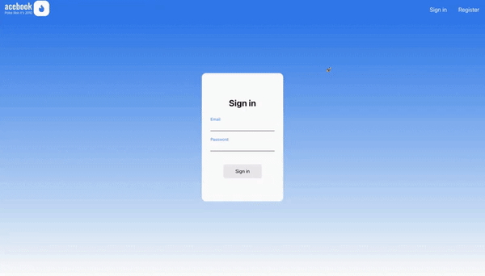
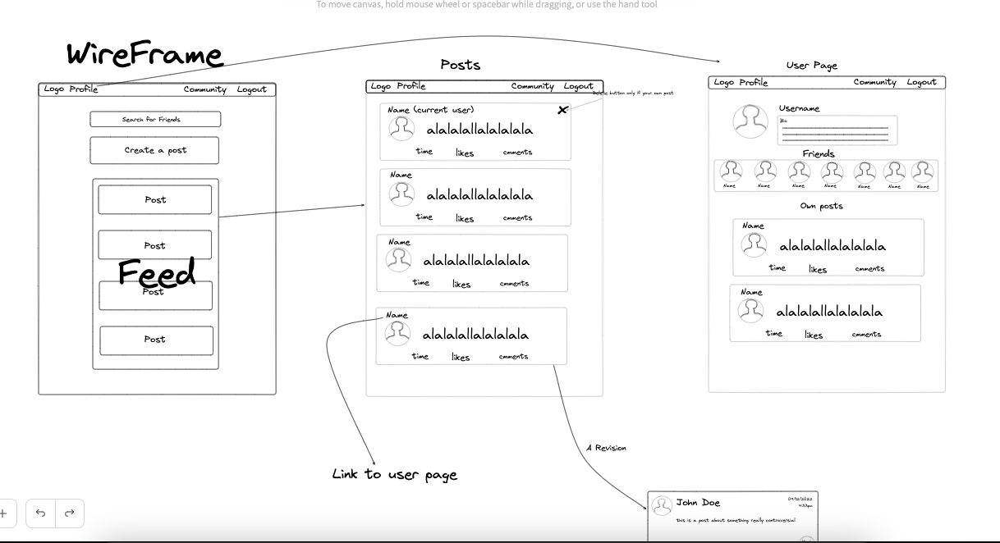

# Acebook

In this project our team of 6 were given a partially written MERN stack with basic functionality already in existence. It covered the signup, login and logout functionality.

The primary challenge was to familiarise ourselves with an unknown codebase and a tech stack we had very limited experience with. Once we had got an understanding of the code we had to improve and add to the code base, sticking to TDD and Agile as we worked.

### Contents

- [Technologies](#technologies)
- [Demonstration](#demonstration)
- [Planning](#planning)
  - [Sprints](#sprints)
  - [MVP User Stories](#mvp-user-stories)
  - [Stretch User Stories](#stretch-user-stories)
  - [Wireframes](#wireframes)
- [Features](#features)
  - [MVP](#mvp)
  - [Stretch](#stretch)
- [To run locally](#to-run-locally)
- [Testing](#testing)
- [Learnings](#learnings)
- [Future Actions](#future-actions)

## Technologies

<div align="center">
	<code></code>
	<code></code>
	<code></code>
	<code></code>
	<code></code>
	<code></code>
	<code></code>
</div>

## Demonstration

Here's a short demonstration covering some of the functionality



## Planning

When starting this project it was our first time working with a full MERN stack. While we had some experience with each technology on their own, this was the first time we would pull them all together.

Before attempting to plan our workflow, or next steps, we spent several hours on the first day purely just investigating the code. We divided up into pairs, with each pair focusing on a specific aspect of the code and any associated part of the MERN stack it used.

Once we all felt comfortable that we had a good understanding of our areas we gathered as a team to share what we had learned so all the team became familiar with all the code.

As a team we found it very helpful to visually represent the structure of the code when knowledge sharing.


### Sprints

As we only had 10 days for this project we settled on 3 sprints. The objective of sprint 1 was to finish our MVP. Then in sprints 2 and 3 we could implement our stretch goals.

Each feature we implemented was split down further into smaller tickets to help build out the code in smaller increments, helping to make merging pull requests easier.

### MVP User Stories

```
As a user I want to be able to
Create an account, providing a username, email and password

As a user I want to be able to
Log in

As a user I want to be able to
Log out

As a user when I log in
I want to see posts by my friends in reverse-chronological order

As a user once logged in
I want to be able to write a post (that can be seen by my friends)

```

### Stretch User Stories

```
As a user
I want to be able to leave a comment on a friends post

As a user
I want to be able to delete a post I have made

As a user
I want to be able to edit a post I have made

As a user
I want to be able to view my friend’s profile, and all their recent posts

As a user I want to be able to
Add other users to my friends list

As a user
I can delete friends who betray me

As a user
I can block friends who dump me

As a user
I can poke friends who ghost me

As a user
I can upload photos

As a user
I can upload videos

As a user
I want to be able to like a post
```

### Wireframes

After scoping out our user stories we took the time to wireframe the frontend of our project. This was so everyone could put their ideas forward and get on the same page with regard to what we were aiming for, from the UI perspective.

Additionally, it helped plan what React components we would need to create and how they would interact with each other.



## Features

### MVP

The user can:

- Sign up, create an account and log in/out
- See all posts
- Create a post

### Stretch

The user can:

- Comment on a friends post
- Add friends
- View their own, and other's, profile page
- Edit a post
- Delete a post
- Like a post

## To run locally

1. Clone the repo locally
2. Start the backend server

```
cd api
JWT_SECRET=SUPER_SECRET npm start
```

3. Start the frontend in a new terminal window

```
npm start build
```

## Testing

While we did put an emphasis on testing driving all of our code, we found with the challenge of learning a new tech stack and the tight time frame, our normally stringent testing suffered.

For our backend testing we used jest. To run these tests:

1. Start the backend server

```
cd api
JWT_SECRET=SUPER_SECRET npm start
```

2. In a new terminal window run

```
jest --coverage
```

For our frontend testing we used Cypress. This was our first time using Cypress so it was an intense learning curve but Cypress's UI and intuitive design really helped. To run Cypress testing:

```
cd frontend
npm run cypress:open
```

## Learnings

As a team it was a great experience, getting to work with so many different people on a new tech stack. While it was dauting to start with, our methodical approach at the start, knowledge sharing and being process driven throughout really helped.

Going forward the key takeaway is how to adjust our sprint planning. We didn't break down the tickets into small enough tasks. This sometimes resulted in backlogs and rather than small, frequent pull requests, we had to combine a lot of different branches at the end of the project. In turn, this had an impact on our time available to focus on core ways of working like TDD.

Overall we learnt a huge amount and very quickly became confident utilisng a MERN stack. Most importantly we also learnt how to structure our team and processes going forward.

## Future Actions

- Deploy the site
- TDD the comments functionality
- Improve the functionality of the profile page
